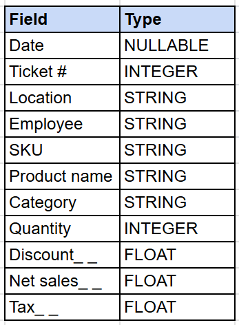

## This Page Includes:
* Analysis Project Overview
* Dataset Details
* SQL Queries Used

To view regression model setup and execution details, click [here](./Regression-Setup-&-Execution.md). To view the full executive report, click [here](https://docs.google.com/document/d/13WyTioV-JLnFqsjsWH5RaKfD5tZsQBvFkX1OmZiTm1Y/edit?tab=t.0).

<br>


## Project Overview

In August 2025, the pricing model of the hat sale section was changed company-wide from a BOGO model, to flat-priced sections.

Sales performance data across all stores was analyzed to determine whether this change had an impact on revenue. SQL was used for data gathering, Tableau for visualization and analysis, and Excel for regression modeling. 

The analysis identified a significant decline in sale hat section revenue following the change and found the primary driver to be the removal of the BOGO pricing model, which reduced the number of multi-item purchases that were fueling sales.

Insights and recommendations were compiled into a report and presented to leadership, influencing the decision to revise the pricing model company-wide. Performance monitoring was put in place and showed a sustained 25% increase in monthly revenue. This success led to the model being permanently adopted.

<br>

## Dataset

* **Source:** item-level sales transactions across all stores (from POS provider)
* **Time Period:** 2024 - 2025
* **Number of rows:** 1.1M

<br>

**Original Schema:**




**Preparation:** Data was extracted from the POS provider and loaded into BigQuery. Details on the specific SQL queries used to clean and wrangle data used for analysis can be found below.


<br>

## SQL Queries Used


### Gathering Data on Sale Hats Only

```SQL
-- This query filtered all item-level transaction data to sale hats only, and was also used to create the ‘ClearanceSales’ table.


-- Field names were cleaned to consistent formatting.
WITH Cleaned_Data AS (
    SELECT
        Date,
        `Ticket #` AS Ticket_Id,
        Location,
        REPLACE(`Product Name`, ' ', '_') AS Product_Name,
        REPLACE(REPLACE(TRIM(Category), ' ', '_'), '/', '') AS Category,
        Quantity,
        Tax,
        `Net Sales_ _` AS Net_Sales
    FROM
        `Portfolio_Data.Sales`
    WHERE
        (Date BETWEEN '2024-01-01' AND '2025-12-31')
    AND
        (LOWER(Product_Name) <> 'gift_card')
),


-- This block filters for hat categories only, and filters out product names that have a normal price point that is the same as our sale section price while preserving instances where those products were discounted.
Categories AS (
    SELECT
        *
    FROM
        Cleaned_Data
    WHERE
        Category IN (
            'SNAPBACK', 'ROPER', 'A_FRAME', 'BUCKET', 'HATS',
            'UNSTRUCTURED_ADJ', 'FITTED', 'FLEXONE_FITS', 'STRUCTURED_ADJ', 'VISOR')
        AND
        (Product_Name NOT IN (
            'Special_Product1', 'Special_Product2', 'Special_Product3')
            OR Discount > 0
        )
        AND Net_Sales > 17
)


-- We found that our dataset's ‘discount’ field often shows $0 for items that are real sale hat transactions, making the field unreliable to filter for sale hats. Due to this limitation, we had to find another way to isolate sale hat data. The solution was to filter our results to only show data where the total sales at each quantity sold could only be at or lower than the sale section price point ("Net_Sales < (Quantity * 42)").

SELECT
    Date,
    Location,
    Product_Name,
    Category,
    Ticket_Id,
    Quantity,
    Net_Sales,
FROM
    Categories
WHERE
    Net_Sales < (Quantity * 42)

ORDER BY
    Date;
```

<br>
<br>

### Hat Sale Section Revenue Per Store & Day

```SQL
SELECT
  Date,
  Location,
  ROUND(SUM(Net_Sales),2) AS Net_sales
FROM
  Portfolio_Data.ClearanceSales 
GROUP BY
  Date,
  Location
ORDER BY 
  Date, 
  Location;
```
<br>
<br>

### Gathering Data on Full-Price Hats Only
```SQL
-- This query filtered all item-level transaction data to full-price hats only, and was also used to create the ‘FullPriceSales’ table.

-- First, field names were cleaned to consistent formatting.
WITH Cleaned_Data AS (
    SELECT
        Date,
        `Ticket #` AS Ticket_Id,
        Location,
        REPLACE(`Product Name`, ' ', '_') AS Product_Name,
        REPLACE(REPLACE(TRIM(Category), ' ', '_'), '/', '') AS Category,
        Quantity,
        Tax,
        `Net Sales_ _` AS Net_Sales
    FROM
        Portfolio_Data.Sales
    WHERE
        (Date BETWEEN '2024-01-01' AND '2025-12-31')
    AND
        (LOWER(Product_Name) <> 'gift_card')
),


-- filters for hat categories only
Categories AS (
    SELECT
        *
    FROM
        Cleaned_Data
    WHERE
        Category IN (
            'SNAPBACK', 'ROPER', 'A_FRAME', 'BUCKET', 'HATS',
            'UNSTRUCTURED_ADJ', 'FITTED', 'FLEXONE_FITS', 'STRUCTURED_ADJ', 'VISOR')
)
-- Due to our discount column frequently showing $0 even for sale items, we couldn't use it to reliably isolate full-price hats. The solution was to filter our data to only show items that had a sale price that was above the sale section threshold.

SELECT
    Date,
    Location,
    Product_Name,
    Category,
    Ticket_Id,
    Quantity,
    Net_Sales
FROM
    Categories
WHERE
    Net_Sales > (Quantity * 42)
    OR (
        Product_Name IN (
            'Special_Product1', 'Special_Product2', 'Special_Product3')
            AND Discount = 0
    )
ORDER BY
    Date;
```

<br>
<br>


### Total Full-Price Hat Sales Per Day 

```SQL
SELECT
  Date,
  Location,
  Category,
  ROUND(SUM(Net_Sales),2) as Net_sales
FROM
  Portfolio_Data.FullPriceSales 
GROUP BY
  Date,
  Location,
  Category
ORDER BY
  Date, 
  Location,
  Category;
```


<br>
<br>

### Setting Up Regression Model 
```SQL

-- The purpose of this query was to gather the variables needed for our regression model to determine whether sale hat section revenue meaningfully declined after the pricing model change in August while keeping seasonality constant.


SELECT
Date,
ROUND(SUM(Net_Sales),2) AS Net_Sales, -- Total sales per day
ROW_NUMBER() OVER(order by date) AS Time_index, -- Running count of days from 2024 - 2025
CASE WHEN Date >= '2025-08-01' THEN 1 ELSE 0 END AS After_Period, -- Assigns post-pricing-change days with a 1 and pre-change with a 0.

-- The following columns assign a 1 to days in the corresponding month and a 0 otherwise so the regression can account for seasonality between months.
CASE WHEN CAST(DATE_TRUNC(Date, MONTH) AS STRING) LIKE '%01-01%' THEN 1 ELSE 0 END AS Jan,

CASE WHEN CAST(DATE_TRUNC(Date, MONTH) AS STRING) LIKE '%02-01%' THEN 1 ELSE 0 END AS Feb,

CASE WHEN CAST(DATE_TRUNC(Date, MONTH) AS STRING) LIKE '%03-01%' THEN 1 ELSE 0 END AS Mar,

CASE WHEN CAST(DATE_TRUNC(Date, MONTH) AS STRING) LIKE '%04-01%' THEN 1 ELSE 0 END AS Apr,

CASE WHEN CAST(DATE_TRUNC(Date, MONTH) AS STRING) LIKE '%05-01%' THEN 1 ELSE 0 END AS May,

CASE WHEN CAST(DATE_TRUNC(Date, MONTH) AS STRING) LIKE '%06-01%' THEN 1 ELSE 0 END AS Jun,

CASE WHEN CAST(DATE_TRUNC(Date, MONTH) AS STRING) LIKE '%07-01%' THEN 1 ELSE 0 END AS July,

CASE WHEN CAST(DATE_TRUNC(Date, MONTH) AS STRING) LIKE '%08-01%' THEN 1 ELSE 0 END AS Aug,

CASE WHEN CAST(DATE_TRUNC(Date, MONTH) AS STRING) LIKE '%09-01%' THEN 1 ELSE 0 END AS Sep,

CASE WHEN CAST(DATE_TRUNC(Date, MONTH) AS STRING) LIKE '%10-01%' THEN 1 ELSE 0 END AS Oct,

CASE WHEN CAST(DATE_TRUNC(Date, MONTH) AS STRING) LIKE '%11-01%' THEN 1 ELSE 0 END AS Nov,

CASE WHEN CAST(DATE_TRUNC(Date, MONTH) AS STRING) LIKE '%12-01%' THEN 1 ELSE 0 END AS Dec

FROM
    `Portfolio_Data.ClearanceSales`
WHERE
    LOWER(Location) NOT LIKE '%store c%' -- Omits outlier store 
GROUP BY
    Date
ORDER BY Date;
```

<br>
<br>


### Average Monthly Hat Sale Section Revenue 
```SQL
--This query was used to gather the average sales per month pre-pricing-change (Before 8/25) to later use in our annual sales projection.

WITH Base AS (
    SELECT
        DATE_TRUNC(Date, MONTH) AS Date,
        SUM(Net_Sales) AS Net_Sales
    FROM
        `Portfolio_Data.ClearanceSales`
    WHERE
        Date < '2025-08-01'
        AND LOWER(Location) NOT LIKE '%store c%' -- Omits outlier store 
    GROUP BY
        DATE_TRUNC(Date, MONTH)
)


SELECT
    EXTRACT(MONTH FROM Date) AS MonthNum,
    ROUND(AVG(Net_Sales), 2) AS AvgSales
FROM
    Base
GROUP BY
    EXTRACT(MONTH FROM Date)
ORDER BY
    MonthNum;
```


<br>
<br>


### Tickets With 2+ Sale Hats 
```SQL
-- First, we isolated transactions containing 2 or more sale hats by filtering our sale hat sales dataset to only show rows of sales that occurred when the quantity of the ticket is two or more.

WITH TwoPlusHatTickets AS (
    SELECT
        Ticket_Id,
        Location,
        Date,
        SUM(Quantity) AS TicketWIthTwoPlusHats
    FROM
        Portfolio_Data.ClearanceSales
    GROUP BY
        Ticket_Id,
        Location,
        Date
    HAVING
        (SUM(Quantity) >= 2)
),


-- Next, we gathered the total number of tickets containing 2+ sale hats per store and day.
Total2PlusTickets AS (
    SELECT
        Location,
        Date,
        COUNT(DISTINCT Ticket_Id) AS Days2PlusHatTickets
    FROM
        TwoPlusHatTickets
    GROUP BY
        Location,
        Date
)


-- Our final output shows the total number of tickets with 2+ sale hats per store and day.
SELECT
    Date,
    Location,
    Days2PlusHatTickets,
FROM
    Total2PlusTickets
ORDER BY
    Date,
    Location;
```

<br>
<br>


### Multi-Quantity Vs Single-Quantity Sale Item Revenue Per Store & Day 
```SQL
-- Querying our dataset of just sale hats, we first totaled sales and quantity sold of each ticket, location, and day.
WITH TicketsCombined AS (
    SELECT
        Location,
        Date,
        SUM(Net_Sales) AS Net_Sales,
        SUM(Quantity) AS Quantity
    FROM
        Portfolio_Data.ClearanceSales
    GROUP BY
        Ticket_Id,
        Location,
        Date
),

-- Case statements were used to gather total revenue of sale hats when only 1 hat was sold as well as when 2 or more hats were sold.
QtyCase AS (
    SELECT  
        Date,
        Location,
        COALESCE(ROUND(SUM(CASE WHEN Quantity = 1 THEN Net_Sales ELSE 0 END), 2), 0) AS Qty1Revenue,
        COALESCE(ROUND(SUM(CASE WHEN Quantity > 1 THEN Net_Sales ELSE 0 END), 2), 0) AS Qty2PlusRevenue
    FROM
        TicketsCombined
    GROUP BY
        Date,
        Location
)
-- Our final output shows separate columns for sales of the hat sale section when quantity = 1 and when quantity is 2+ per day and location

SELECT
    Date,
    Location,
    Qty1Revenue,
    Qty2PlusRevenue
FROM
    QtyCase
ORDER BY
    Date,
    Location;
```

