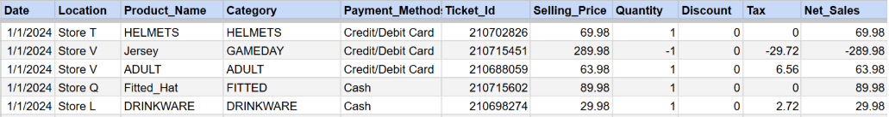
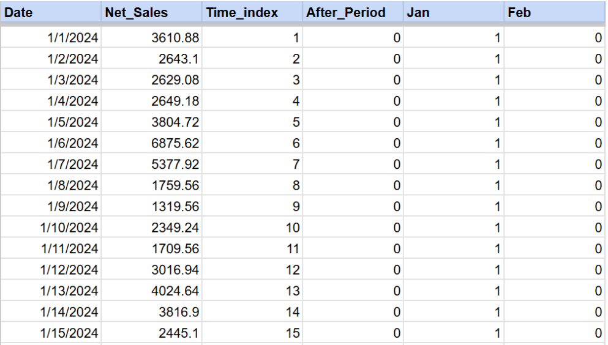
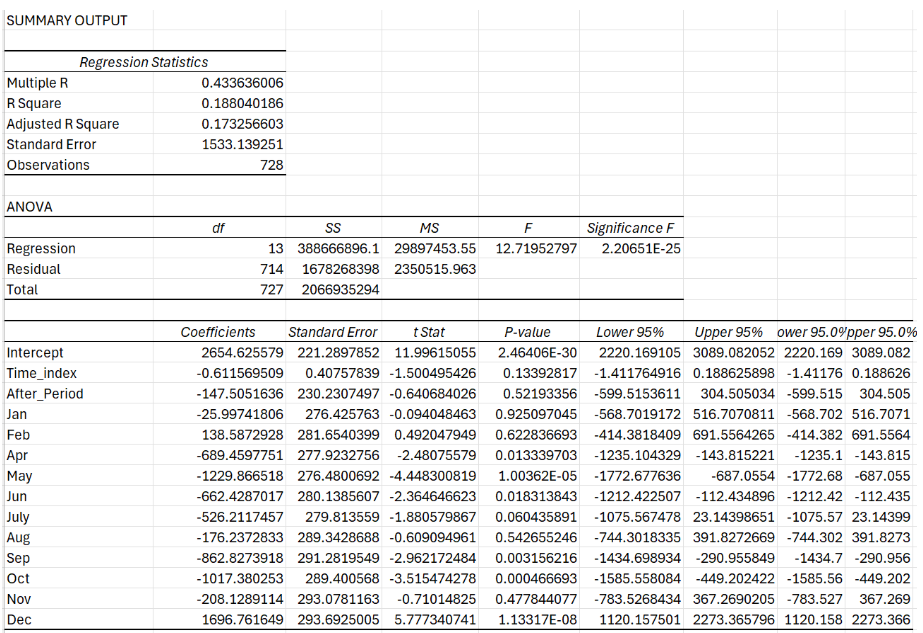
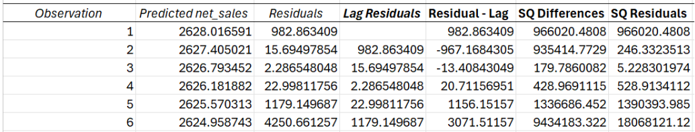
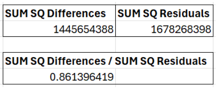
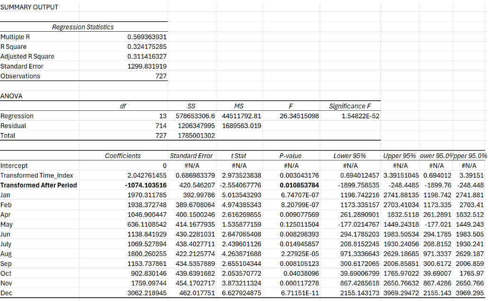

# Regression Setup & Execution

## Objective & Reasoning
Our main goal was to determine if there was a statistically significant decrease in company-wide sale hat revenue in the period following the pricing change. Regression, put simply, is a statistical technique used to find out how much an outcome variable changes as a result of changes in one or more input variables. In our case, we wanted to find out how the post change period affected sale hat revenue while controlling for seasonality and time trends to determine if there truly was a statistical decrease in revenue after the change occurred.

<br>

## Methods and Steps Taken:

1. Our data began as item level transactions of all products from 2024 through 2025.

**Example of data at this stage:**



<br>

2. We then created an (SQL query) to gather the variables used in the regression model. Fields made and their purposes are outlined below:

    1. **Date:**  Each day from January 2024 through 2025.

    2. **Net sales:**  Sale hat section revenue on each day.

    3. **Time index:** Counted the number of passing days starting from 1 on January 1st 2024 and counted through 2025. This variable was used in our regression to control for how much sales naturally increase or decrease per day over time independent of monthly seasonality and the pricing change. 

    4. **After period:** This field is used to identify sales that occurred in the days following the sale hat pricing change. Days prior to the change are represented with a 0 and days post change are represented with a 1. This allows our regression model to understand which days came after the change, and correctly attribute a difference in daily sales to the change itself rather than seasonality and trends over time.

    5. **Month names (Jan - Dec):** Using a similar principle as the after period field, we made fields for each month of the year and assigned a 1 to sales values that occurred on days in that month in both 2024 and 2025, and a 0 to days that didn't occur in that month. These fields were created so our model could control for recurring monthly seasonality in sales. This means our afterperiod variable was not impacted by the usual increase in sales seen in November / December. The month of March was omitted from our month fields to serve as a baseline month under normal conditions.


**Example Data Used for Regression Model:**



<br>

3. Our new dataset was then imported into Excel.
4. We then ran our regression using the Excel add in “data analysis tool pak”. Net sales was used as our Y variable, and all other fields were used as X variables. Running regression produced the following initial result:



<br>
  
When running a regression with time series data, it is good practice to test for autocorrelation which, if present, can produce results that are less precise. We tested for autocorrelation using the Durbin-Watson test which tests whether the errors in one period predict errors in the next.

5. **To perform the Durbin-Watson test we took the following steps:**
    1. We started by using our residuals to produce a column of lagged residuals.
    2. Then created a column of differences between residuals and lagged residuals.
    3. Squared the differences column and the residuals column.
    4. Took the sum of squared differences  as the numerator and the sum of squared residuals as the denominator and divided to calculate a Durbin--Watson statistic.

 **Example Data Used To Conduct Durbin Watson Test:**





<br>

The results of our test indicated positive autocorrelation **0.86** which means the result of our initial regression was invalid. To produce a more accurate regression result we used the Cochrane–Orcutt Procedure, which corrects for autocorrelation.

6. **To perform the Cochrane–Orcut procedure we took the following steps:**
    1. First, we ran a new Excel regression using our original outputs residuals as our Y variable and our lagged residuals as our X variable. This produced a slope coefficient (p^ rho) of **0.569** in our case.
    2. Now for each individual column in our original input (Y = Net Sales, X = Variables) we used a formula to transform each column's values so the regression model now runs on variables that are uncorrelated.

**Formula Used To Transform Y variable:**

```excel
  =SUM(Y2-(p^ rho * Y1)) 

  Y2 = the second value in net sales 
  Y1 = the first value in net sales 
```

**Formula Used To Transform X variable:**

```excel
  =SUM(X2-(p^ rho * X1))
  
  X2 = the second value 
  X1 = the first value 
```

7. After transforming each variable we then ran a new Excel regression using the transformed variable for net sales as Y and the transformed X variables as X. When setting up the dialogue box for regression, we also checked the box “constant is zero” for the intercept. 


**Running a regression on these transformed variables produced the following result:**



<br>

We then repeated the Durbin-Watson test on our new regression results to determine if autocorrelation still exists. This time, our resulting Durbin-Watson statistic was **1.63** which is within the threshold for no autocorrelation, meaning we can use our results.


This was the series of steps taken to arrive at our conclusion of daily sales in the sale hat section being, on average, **$1074** lower after the sale hat pricing change was implemented.

